# 🔮 Casper Risk Oracle

> **An AI-Driven, Real-Time Risk Analysis Engine for Liquid Staking on the Casper Network.**

[](https://testnet.cspr.live)
[]()
[]()

## 📖 Overview

The **Casper Risk Oracle** is a "Living System" designed to bring institutional-grade risk assessment to the Casper ecosystem. Unlike static oracles, this system uses an **AI-powered Risk Engine** to continuously simulate and analyze validator performance, pushing real-time "Risk Scores" to a smart contract. A "DeFi Terminal" style dashboard allows users to monitor these scores instantly.

This project demonstrates a full-stack integration of:
1.  **Smart Contracts (Rust/Odra)**: Immutable on-chain storage of risk profiles.
2.  **AI Agents (Python)**: Off-chain computation using weighted risk models.
3.  **Real-Time Dashboard (Next.js)**: A professional, auto-refreshing UI for stakeholders.

---

## 🏗 System Architecture

The system consists of three core components working in harmony:

```mermaid
graph TD
    A[🤖 AI Oracle Agent] -- "Computes Risk (Concentration, Volatility)" --> B(📝 RiskEngine);
    B -- "Pushes Score (Signed Deploy)" --> C{⛓️ Casper Smart Contract};
    D[💻 DeFi Dashboard] -- "Polls State (JSON-RPC)" --> C;
    C -- "Returns Risk Score & Metadata" --> D;
```



### 1. The "Immutable Backbone" (Smart Contract)
-   **Framework**: [Odra v2.4.0](https://odra.dev) (Rust)
-   **Network**: Casper Testnet
-   **Logic**: Stores a mapping of `Validator Address -> Risk Score (0-100)`. Only an authorized "Oracle Admin" can update scores, preventing manipulation.
-   **Contract Hash**: `d0f58ef1f2de95bf8daafd94e334af4c29525fbfba39f60f05f7548a1e44f414`

### 2. The "Smart Simulation Engine" (Python Agent)
-   **Logic**: Implements the **Casper Liquid Staking Risk Model (CLSRM)**.
    -   `Risk = 0.4(Concentration) + 0.3(Volatility) + 0.3(Slashing_Risk)`
-   **Features**:
    -   **Director Mode**: Validates demo scenarios via `override.txt`.
    -   **Anti-Crash**: Resilient to network timeouts.
    -   **Matrix Logs**: Beautiful ANSI-colored terminal output.
    -   **NodeOps Ready**: Includes `Dockerfile` for containerized deployment.

### 3. The "Vote Magnet" Dashboard (Frontend)
-   **Stack**: Next.js 14, Tailwind CSS, Casper JS SDK.
-   **Design**: "Bloomberg Terminal" aesthetic (Dark Mode, Monospace, Glassmorphism).
-   **Real-Time**: Auto-polls the blockchain every 5 seconds.
-   **Rich Data**: Translates raw scores into actionable insights (e.g., "⚠️ High Concentration", "✅ Decentralized").

---

## 🚀 Getting Started

### Prerequisites
-   Node.js & npm
-   Python 3.9+
-   Rust & Cargo (for contract development)
-   Casper Client

### 🛠️ Installation & Usage

[](https://vercel.com/new/clone?repository-url=https%3A%2F%2Fgithub.com%2FTejasv-Singh%2FCasper-Risk-Oracle&project-name=casper-risk-oracle&repository-name=casper-risk-oracle&root-directory=risk-dashboard)

#### 1. Contract Deployment (Optional)
*The contract is already deployed on Testnet. Skip this if you just want to run the agent/dashboard.*
```bash
cd casper_risk_oracle
cargo odra build
# Deploy using casper-client (see internal docs)
```

#### 2. Running the AI Oracle Agent
This script will start pushing data to the blockchain.
```bash
cd casper_risk_oracle
# (Optional) Create virtual env
# python3 -m venv venv && source venv/bin/activate
pip install casper-python-sdk # or use included subprocess logic
python3 oracle_agent.py
```
> **Director Mode**: To force a specific score for demos, write to `override.txt`:
> `echo "90" > override.txt` (Forces High Risk)

#### 3. Launching the Dashboard
```bash
cd risk-dashboard
npm install
npm run dev
```
Open [http://localhost:3000](http://localhost:3000) to view the terminal.

---

## 📸 Demo Scenarios

1.  **The "Safe" Scenario**:
    -   Agent calculates **Low Risk** (Score < 40).
    -   Dashboard shows: **GREEN Shield**, "SAFE TO STAKE", and "99.9% Uptime".

2.  **The "Black Swan" Scenario**:
    -   Use Director Mode to push **High Risk** (Score > 75).
    -   Dashboard instantly flashes **RED**, showing "⚠️ High Concentration" and "CONSIDER UNSTAKING".

---

## 🔮 Future Roadmap

-   [ ] **ChainGPT Integration**: Use AI to analyze social sentiment as a 4th risk factor.
-   [ ] **Mainnet Launch**: Deploy to Casper Mainnet with real validator data feeds.
-   [ ] **Notification Bot**: Telegram/Discord alerts when risk scores spike.

---

## 🏆 Hackathon Tracks
-   **DeFi**: Real-time risk infrastructure for liquid staking.
-   **Gaming/NFT**: (N/A)
-   **Tooling/Infra**: A complete Oracle stack with dashboard.

---
*Built with ❤️ for the Casper Hackathon.*
